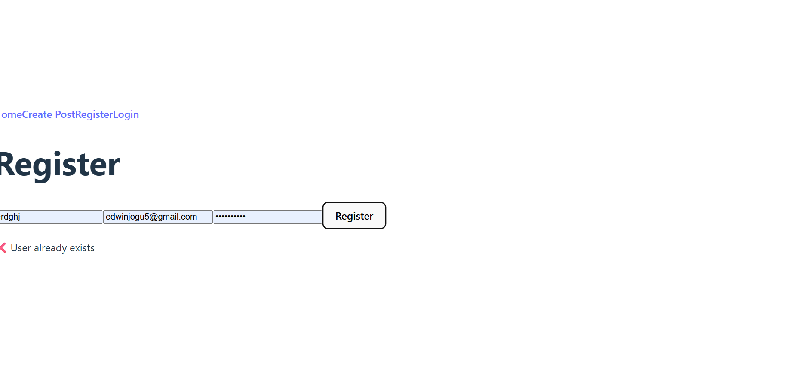

# MERN Blog — Full Stack Integration (Assignment)

A full-stack blog application built with the MERN stack (MongoDB, Express, React, Node). This repository contains a starter/assignment project used for Week 4 of the MERN integration course. The application demonstrates REST API design, database modeling with Mongoose, a React/Vite front-end, authentication, file uploads, and client-server integration.

## Table of contents
- Project overview
- Tech stack
- Features implemented
- Setup (server + client)
- Environment variables
- API documentation
- Data models (summary)
- Front-end routes & structure
- Screenshots
- Development notes
- Contributing
- License

## Project overview

This project is a blog platform where users can register, log in, create posts, browse posts by category, and (optionally) upload featured images. The repository is organized with a `client/` folder for the React front-end and a `server/` folder for the Express API.

## Tech stack

- Front-end: React (Vite), React Router, fetch/axios for API calls
- Back-end: Node.js, Express.js
- Database: MongoDB (Mongoose)
- Auth: JWT-based authentication
- Tooling: ESLint, Vite, nodemon (dev)

## Features implemented

- User registration and login (JWT)
- Create / Read / Update / Delete (CRUD) for blog posts
- Categories listing and creation
- Image upload support for post featured images (server-side handling)
- Protected routes (create/edit/delete require authentication)
- Basic client-side form validation and error handling
- API error-handling middleware

If you added more features while completing the assignment (pagination, search, comments, optimistic UI), list them here as well.

## Getting started — prerequisites

- Node.js (v18+ recommended)
- npm (comes with Node) or yarn
- MongoDB (local) or a MongoDB Atlas account

## Setup and run (development)

Open two terminals (or use a multiplexer). These commands are shown for PowerShell/Windows and POSIX shells — they are the same for both in most cases.

Server

```powershell
cd server
npm install
# create a .env file (see .env.example) then:
npm run dev
```

Client

```powershell
cd client
npm install
# create a .env file if needed then:
npm run dev
```

Notes
- The server is expected to run on a port such as 5000 and the client on 5173 (Vite). The client should proxy API requests to the server; see `client/vite.config.js` for proxy configuration.
- If you use MongoDB Atlas, supply the connection string in `server/.env`.

## Environment variables

Create `.env` files in `server/` and (optionally) `client/`. Example `server/.env`:

```
MONGO_URI=mongodb+srv://<user>:<password>@cluster0.mongodb.net/mern-blog?retryWrites=true&w=majority
JWT_SECRET=your_jwt_secret_here
PORT=5000
```

Add a `.env.example` to the repo with these variable names (without real secrets). Do NOT commit real credentials.

## API documentation

Base URL (development): http://localhost:5000/api

All endpoints that modify data require an Authorization header with a Bearer token (JWT) for protected routes.

### Posts
- GET `/api/posts` — Get all posts (query params: page, limit, search, category)
- GET `/api/posts/:id` — Get a specific post by id
- POST `/api/posts` — Create a new post (protected)
  - Body (JSON): `{ "title": "...", "content": "...", "category": "<categoryId>", "imageUrl": "..." }`
- PUT `/api/posts/:id` — Update a post (protected — author or admin)
- DELETE `/api/posts/:id` — Delete a post (protected — author or admin)

### Categories
- GET `/api/categories` — Get all categories
- POST `/api/categories` — Create a new category (protected)

### Auth (example)
- POST `/api/auth/register` — Register new user
  - Body: `{ "username": "...", "email": "...", "password": "..." }`
- POST `/api/auth/login` — Log in
  - Body: `{ "email": "...", "password": "..." }`
  - Response: `{ "token": "<jwt>", "user": { ... } }`

### Files / Uploads (if implemented)
- POST `/api/upload` — Upload a file (image) and receive a URL (multipart/form-data)

### Error format
- Errors are returned with an HTTP status code and JSON payload, for example:

```json
{
  "success": false,
  "message": "Validation error",
  "errors": ["title is required"]
}
```

## Data models (summary)

### Post (example)
- `title`: String
- `content`: String
- `author`: ObjectId -> User
- `category`: ObjectId -> Category
- `imageUrl`: String
- `createdAt`, `updatedAt`

### Category
- `name`: String

### User
- `username`: String
- `email`: String
- `password`: String (hashed)
- `role`: String (optional)

Refer to `server/models/` for the actual Mongoose schemas used in this repo.

## Front-end structure & routes

- `client/src/pages/PostList.jsx` — list view of posts
- `client/src/pages/CreatePost.jsx` — form to create a post
- `client/src/pages/PostDetails.jsx` (or single post view)
- `client/src/pages/Login.jsx`, `Register.jsx` — auth pages
- React Router is used to navigate between pages. The `client/src/services/api.js` file contains the API helper methods.

## Screenshots

Add screenshots to `client/public/screenshots/` and commit them. Example Markdown for screenshots:




If screenshots are not present yet, the above links act as placeholders — add PNG/JPG files with those names to show them here.

## Development notes & tips

- Use `nodemon` (server) for hot-reload during development: `npm run dev` in `server/`.
- The client uses Vite — faster dev server: `npm run dev` in `client/`.
- Keep the JWT token in localStorage (or a cookie) and include `Authorization: Bearer <token>` header in requests that require auth.
- Validate user input both client- and server-side.

## Quality gates (recommended)

- Lint: run ESLint in `client` and `server` if configured.
- Basic sanity test: start server and client and ensure client can fetch `/api/posts`.

## Contributing

This repository is provided as an assignment. If you want to extend it:

1. Fork the repo
2. Create a feature branch
3. Add tests for new functionality
4. Open a PR with a description of changes

## License

This project is provided for educational purposes. Include a LICENSE file as appropriate.

---

If you'd like, I can also:
- Add `.env.example` files for server and client
- Add simple README screenshots (capture from running app) if you provide the images
- Add a short script in `package.json` to run both client and server concurrently
# MERN Stack Integration Assignment

This assignment focuses on building a full-stack MERN (MongoDB, Express.js, React.js, Node.js) application that demonstrates seamless integration between front-end and back-end components.

## Assignment Overview

You will build a blog application with the following features:
1. RESTful API with Express.js and MongoDB
2. React front-end with component architecture
3. Full CRUD functionality for blog posts
4. User authentication and authorization
5. Advanced features like image uploads and comments

## Project Structure

```
mern-blog/
├── client/                 # React front-end
│   ├── public/             # Static files
│   ├── src/                # React source code
│   │   ├── components/     # Reusable components
│   │   ├── pages/          # Page components
│   │   ├── hooks/          # Custom React hooks
│   │   ├── services/       # API services
│   │   ├── context/        # React context providers
│   │   └── App.jsx         # Main application component
│   └── package.json        # Client dependencies
├── server/                 # Express.js back-end
│   ├── config/             # Configuration files
│   ├── controllers/        # Route controllers
│   ├── models/             # Mongoose models
│   ├── routes/             # API routes
│   ├── middleware/         # Custom middleware
│   ├── utils/              # Utility functions
│   ├── server.js           # Main server file
│   └── package.json        # Server dependencies
└── README.md               # Project documentation
```

## Getting Started

1. Accept the GitHub Classroom assignment invitation
2. Clone your personal repository that was created by GitHub Classroom
3. Follow the setup instructions in the `Week4-Assignment.md` file
4. Complete the tasks outlined in the assignment

## Files Included

- `Week4-Assignment.md`: Detailed assignment instructions
- Starter code for both client and server:
  - Basic project structure
  - Configuration files
  - Sample models and components

## Requirements

- Node.js (v18 or higher)
- MongoDB (local installation or Atlas account)
- npm or yarn
- Git

## Submission

Your work will be automatically submitted when you push to your GitHub Classroom repository. Make sure to:

1. Complete both the client and server portions of the application
2. Implement all required API endpoints
3. Create the necessary React components and hooks
4. Document your API and setup process in the README.md
5. Include screenshots of your working application

## Resources

- [MongoDB Documentation](https://docs.mongodb.com/)
- [Express.js Documentation](https://expressjs.com/)
- [React Documentation](https://react.dev/)
- [Node.js Documentation](https://nodejs.org/en/docs/)
- [Mongoose Documentation](https://mongoosejs.com/docs/) 